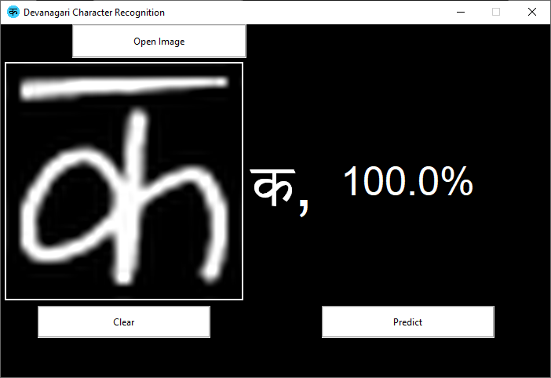
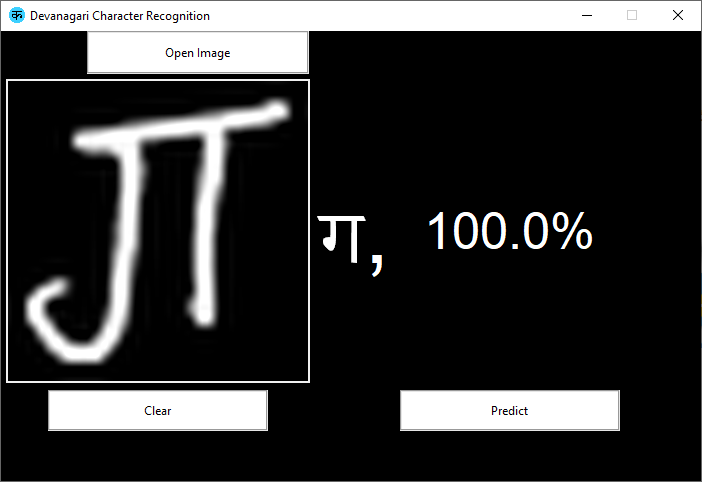
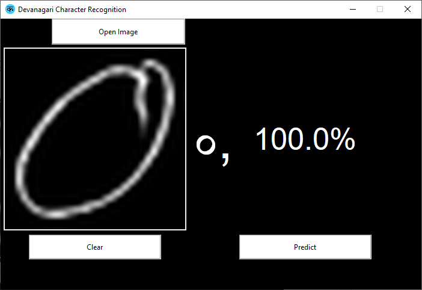
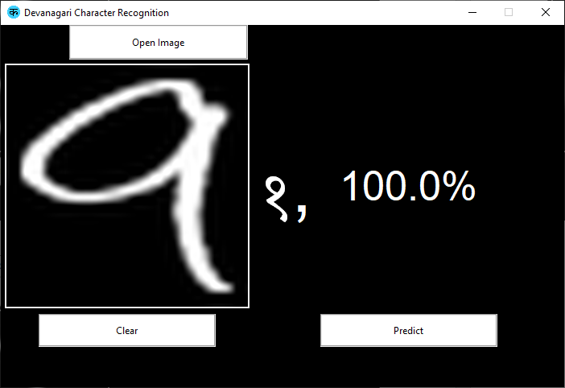
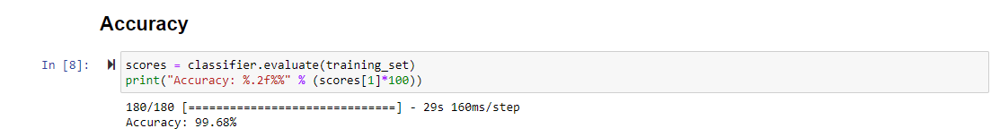

# Devanagari Handwritten Character Recognition based on CNN

A convolutional neural network (CNN, or ConvNet) is a class of deep neural networks, most commonly applied to analyzing visual imagery. They are also known as shift invariant or space invariant artificial neural networks (SIANN), based on their shared-weights architecture and translation invariance characteristics. They have applications in image and video recognition, recommender systems, image classification, medical image analysis, natural language processing, brain-computer interfaces,and financial time series.

In our project we are using the technique of CNN in recognition of Devanagari handwritten characters as CNN is considered to be more powerful than ANN, RNN. CNN are one of the most popular models used today.

This neural network computational model uses a variation of multilayer perceptrons and contains one or more convolutional layers that can be either entirely connected or pooled. These convolutional layers create feature maps that record a region of image which is ultimately broken into rectangles and sent out for nonlinear processing. 

The advantage of using CNN in character recognition is:
- Very High accuracy in image recognition problems.
- Automatically detects the important features without any human supervision.
- Weight sharing.

## Getting Started

### 1. Downloading/Cloning the repo
### Download the repo:
   - Download as a ZIP File:

https://github.com/hariperisetla4431/Devanagari-Handwritten-Character-Recognition-CNN.zip

### Clone the repo:
   - using CLI:
```
git clone https://github.com/hariperisetla4431/Devanagari-Handwritten-Character-Recognition-CNN
```
   - using link:
                 
   https://github.com/hariperisetla4431/Devanagari-Handwritten-Character-Recognition-CNN
   
### 2. Additional requirements
   - [Python](https://www.python.org/) - Programming language used
   - [Jupyter Notebook](https://jupyter.org/) - Notebook Environment
   - [Tensorflow GPU](https://www.tensorflow.org/install/gpu) - GPU support for training of the dataset

### 3. Datset
   The dataset used for the training is from [Kaggle](https://www.kaggle.com/) named as [Devanagari Character Set](https://www.kaggle.com/rishianand/devanagari-character-set) which was made available by [Rishi Anand](https://www.kaggle.com/rishianand) which consists of 92,000 handwritten images of characters from devanagari script

## Outputs

### Letters
 

### Numbers
 

## Accuracy



